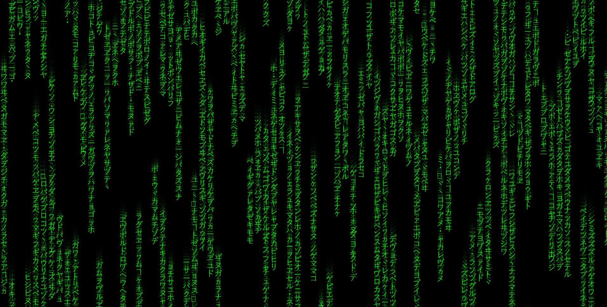

# Matrix

## About this project
This is a simple example to demonstrate how to use P5.js library to create graphical projects using Javascript. In particular this script prints a source code simulation of the famous [Matrix](https://www.imdb.com/title/tt0133093/) movie. You can see it in action [here](https://master.d1iy52s0nx71wy.amplifyapp.com/).

### Built With
* [P5.js](https://p5js.org/)
* Javascript
* HTML

This example doesn't have a build tool since the main library needs to be imported via HTML import script.

## Acknowledgements
* The Coding Train [Youtube channel](https://www.youtube.com/c/TheCodingTrain/featured)
* The Coding Train [Matrix tutorial](https://www.youtube.com/watch?v=S1TQCi9axzg)
* [P5.js](https://p5js.org/examples/) examples
* [The Matrix](https://www.imdb.com/title/tt0133093/)  movie